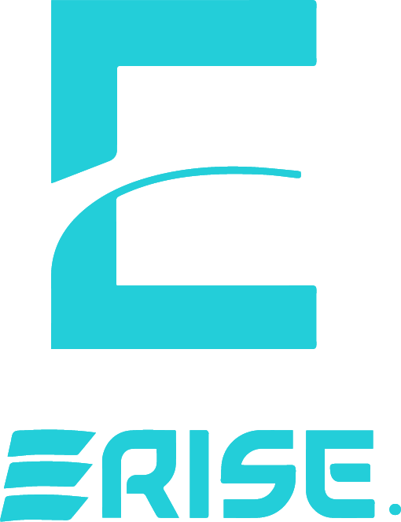

<div align="center">
  

  <h1>E.R.I.S.E. Scientific Club</h1>

  <p><strong>Engineers for Renewable energy Innovation &amp; Sustainability of the Environment</strong></p>

  <p>
    <a href="https://erise-scientific-club.site">🌐 Website</a> ·
    <a href="https://www.instagram.com/erise.club">📸 Instagram</a> ·
    <a href="https://www.linkedin.com/in/erise-club-037589391">💼 LinkedIn</a>
  </p>

  <br />
</div>

---

## 🌱 About

**E.R.I.S.E.** is a student-led scientific club based at the **Higher National School of Renewable Energies, Environment, and Sustainable Development (ENRENA)** in Batna, Algeria.

We are a multidisciplinary community of engineering students passionate about **renewable energy**, **environmental protection**, and **sustainable development**. Through workshops, events, hackathons, and research initiatives, we aim to inspire the next generation of green engineers and innovators.

---

## 🏗️ Our Departments

| Department | Focus |
|---|---|
| 🔬 **Research & Development** | Innovation in renewable energy technologies |
| 💻 **IT & Digital** | Web development, AI, and digital solutions |
| 🎨 **Design & Media** | Visual identity, content creation, and branding |
| 📋 **Projects** | Planning, execution, and management of club initiatives |
| 🤝 **External Relations** | Partnerships, sponsorships, and outreach |
| 📢 **Communication** | Social media, events coverage, and public engagement |

---

## 🚀 Tech Stack

This website is built with modern technologies for performance and visual excellence:

- ⚛️ **React 19** + **TypeScript** — Component-based UI
- ⚡ **Vite** — Lightning-fast build tool
- 🎨 **Tailwind CSS v4** — Utility-first styling
- 🎭 **Framer Motion** — Smooth animations and transitions
- 🌐 **Three.js** / **React Three Fiber** — Interactive 3D experiences
- 🗄️ **Supabase** — Backend database and authentication
- 📧 **Resend** — Transactional email automation
- 🤖 **Google Gemini AI** — Integrated AI chatbot assistant
- ▲ **Vercel** — Deployment and hosting

---

## 🛠️ Getting Started

### Prerequisites

- [Node.js](https://nodejs.org/) v18+

### Installation

```bash
# Clone the repository
git clone https://github.com/pixelforge22/erise-scientific-club-website.git
cd erise-scientific-club-website

# Install dependencies
npm install

# Set up environment variables
# Copy .env.local.example to .env.local and fill in your keys

# Start the development server
npm run dev
```

The app will be running at `http://localhost:3000`.

---

## 📄 License

This project is maintained by the **E.R.I.S.E. Scientific Club** team.

---

<div align="center">
  <sub>Built with 💚 by E.R.I.S.E. — Powering the Future, Sustainably.</sub>
</div>
